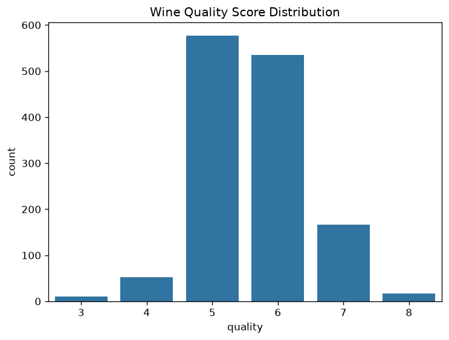
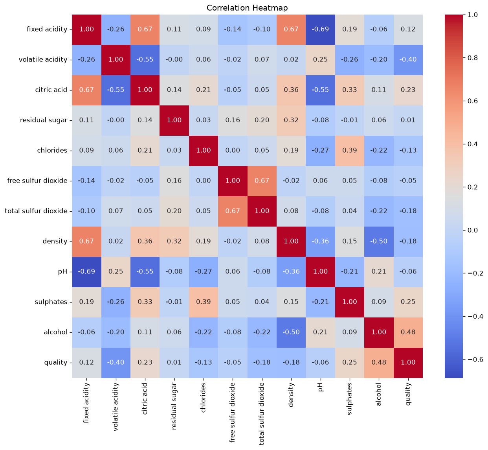
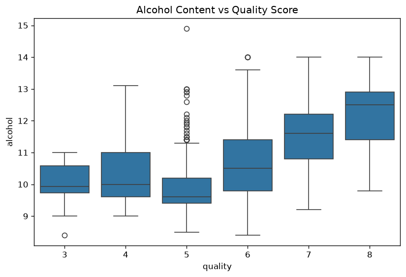
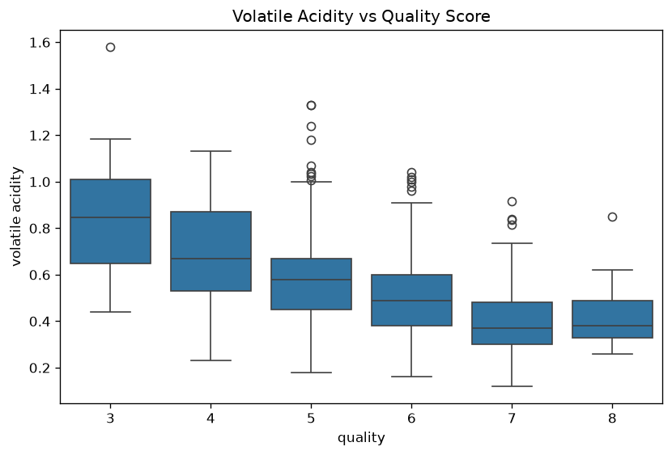
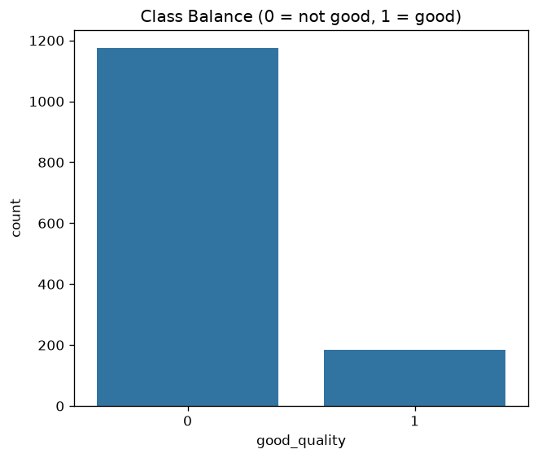
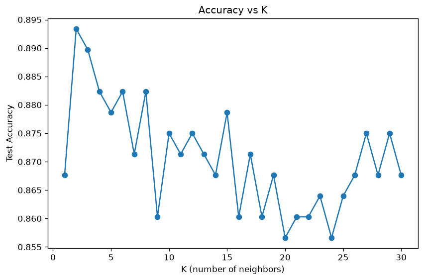
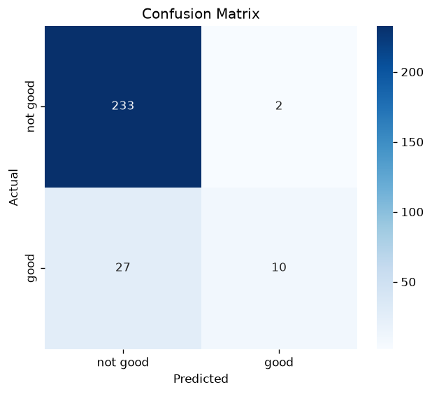
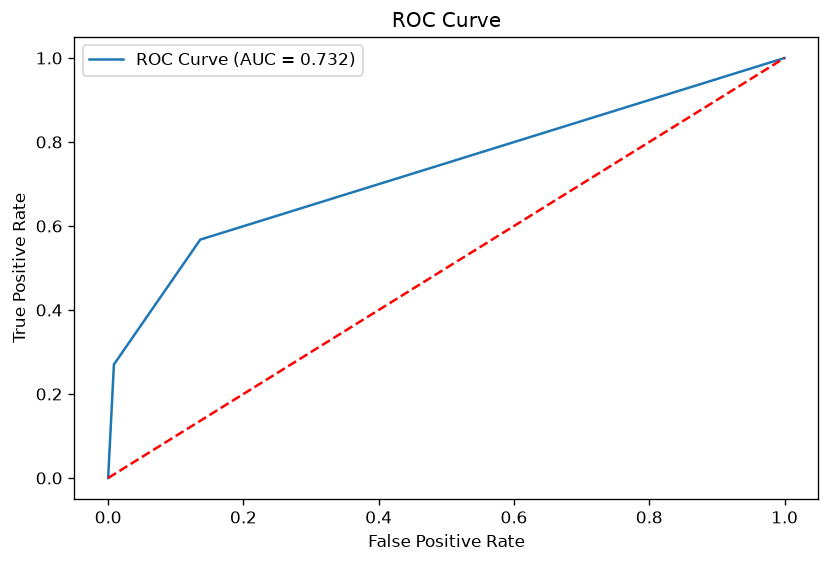

```
K NEAREST NEIGHBOUR PROJECT — CODE EXPLAINED
============================================
A walkthrough of KNN.py, section by section.


1. IMPORT LIBRARIES
--------------------
pandas, numpy        -> handling data (tables, math)
matplotlib, seaborn   -> plotting graphs
sklearn               -> the actual machine learning tools:
  - train_test_split, cross_val_score  -> splitting/testing data
  - StandardScaler                     -> scaling features
  - KNeighborsClassifier                -> the model itself
  - accuracy_score, precision_score, recall_score, f1_score,
    confusion_matrix, classification_report, roc_auc_score, roc_curve
                                        -> scoring the model

Note: KNN classifies a point by looking at its K closest neighbors in
the data and taking a majority vote of their labels. There's no
"formula" being learned like in Linear/Logistic Regression — KNN just
remembers the training data and compares distances at prediction time.


2. LOAD DATA
------------
df = pd.read_csv("Red_Wine_Quality.csv")

Reads the Red Wine Quality dataset into a table (DataFrame) called df.
print(df.head()) shows the first 5 rows so you can eyeball the data.

The target column "quality" is a score from 3 to 8 given by wine tasters.


3. QUICK EDA (Exploratory Data Analysis)
------------------------------------------
Before touching the model, you check:
  - df.shape       -> how many rows/columns (1599 rows, 12 columns)
  - df.info()      -> data types, are there nulls
  - df.describe()  -> mean, min, max, std for every column
  - df.isnull().sum()    -> count of missing values (0 here, good)
  - df.duplicated().sum() -> count of duplicate rows (240 here — not good)
  - df['quality'].value_counts() -> how many wines got each score

Why: KNN is a distance-based model, so it's especially sensitive to
duplicate rows (they get counted as "neighbors" multiple times) and
to unscaled features (a feature with bigger numbers dominates distance).


4. DATA CLEANING
-----------------
df.drop_duplicates(inplace=True)
  -> removes the 240 duplicate rows so they don't get double-counted
     or skew the neighbor voting.


5. DETAILED EDA (visual checks)
---------------------------------
- Quality score countplot: how many wines got each score.
- Correlation heatmap: shows which chemical properties move together
  with quality.
- Alcohol vs Quality boxplot: does higher alcohol content mean higher
  quality?
- Volatile Acidity vs Quality boxplot: same idea for acidity.
```


What it shows: most wines score 5 or 6 (the "average" middle), with
very few at the extremes (10 wines score 3, only 18 score 8). This
imbalance is the root cause of the low recall we see later — there's
just not much data to learn what makes a wine "great."


What it shows: alcohol has the strongest positive correlation with
quality (+0.48) — higher alcohol tends toward higher quality. Volatile
acidity has the strongest negative correlation (-0.40) — sour/vinegary
wines score lower. Fixed acidity, citric acid, density, and pH are
tightly correlated with each other (the dark red block), which makes
sense since they're all related to the wine's acid chemistry.


What it shows: a clear upward trend — median alcohol climbs from about
9.9 at quality 5 to about 12.5 at quality 8. This confirms what the
heatmap suggested: alcohol content is one of the more useful features
for separating decent wine from great wine.


What it shows: the opposite trend — median volatile acidity drops from
about 0.85 at quality 3 down to about 0.37 at quality 7. Lower volatile
acidity (less "vinegar" taste) is associated with better-rated wine.

```
6. FEATURE ENGINEERING
------------------------
df['good_quality'] = (df['quality'] >= 7).astype(int)

The raw quality score (3-8) is turned into a binary label:
  1 -> "good" wine (quality 7 or 8)
  0 -> "not good" wine (quality 3-6)

This mirrors what Logistic Regression did with diagnosis (M/B) — KNN
is shown here for classification, so the target needs to be a category.

X = df.drop(['quality', 'good_quality'], axis=1)   -> the 11 chemical measurements
y = df['good_quality']                               -> the binary target
```


What it shows: a much more severe imbalance than the Logistic
Regression project — 1175 "not good" wines vs only 184 "good" ones
(about 86% / 14%). This single chart explains why accuracy alone will
be misleading here, and why recall (catching the rare "good" wines)
turns out to be hard.

```
7. TRAIN TEST SPLIT
---------------------
X_train, X_test, y_train, y_test = train_test_split(
    X, y, test_size=0.2, random_state=42, stratify=y
)

Splits the data: 80% to TRAIN, 20% to TEST, with stratify=y keeping the
same 86%/14% class ratio in both sets — important given how imbalanced
the classes are here.


8. FEATURE SCALING
--------------------
scaler = StandardScaler()
X_train = scaler.fit_transform(X_train)
X_test  = scaler.transform(X_test)

Rescales every column to have mean 0 and standard deviation 1.

Why this matters MORE for KNN than for Linear/Logistic Regression:
KNN decides who your "neighbors" are by measuring raw distance between
points. "total sulfur dioxide" ranges into the hundreds while
"chlorides" is a tiny decimal — without scaling, sulfur dioxide alone
would dominate every distance calculation and the model would
basically ignore the other 10 features.


9. FINDING THE BEST K
------------------------
k_values = range(1, 31)
for k in k_values:
    knn_k = KNeighborsClassifier(n_neighbors=k)
    knn_k.fit(X_train, y_train)
    accuracies.append(knn_k.score(X_test, y_test))
best_k = k_values[np.argmax(accuracies)]

This is the step that's unique to KNN: unlike Linear/Logistic
Regression, KNN has one critical setting — K, the number of neighbors
to vote with. Too small a K (like K=1) overfits to noise; too large a
K oversmooths and ignores local patterns. This loop just tries every K
from 1 to 30 and picks whichever gives the best test accuracy.

Our result: best K = 2, with test accuracy 0.893 at that K.
```


What it shows: accuracy peaks sharply at K=2 (~0.893), drops, and then
bounces around in a noisy zig-zag between roughly 0.86 and 0.88 for
the rest of the range — there's no smooth "elbow," which itself is a
sign that with only 184 positive examples, accuracy is fairly unstable
no matter which K you pick.

```
10. KNN MODEL
---------------
model = KNeighborsClassifier(n_neighbors=best_k)
model.fit(X_train, y_train)

Fitting a KNN model doesn't "learn" weights the way Linear/Logistic
Regression does — fit() just stores the training data in memory. All
the actual work happens later, at prediction time.


11. PREDICTIONS
-----------------
y_pred  = model.predict(X_test)              -> final class (0 or 1)
y_proba = model.predict_proba(X_test)[:, 1]  -> probability of being "good"

For each test point, predict() finds its K=2 closest training points
(by scaled distance) and takes a majority vote of their labels.
predict_proba() reports what fraction of those neighbors voted "good."


12. EVALUATION METRICS
-------------------------
Results from our run:
  Accuracy  = 0.893   -> 89.3% of test predictions were correct
  Precision = 0.833
  Recall    = 0.270   -> only catches 27% of actual "good" wines
  F1 Score  = 0.408
  ROC AUC   = 0.732

This is the most important result in the whole project: accuracy
LOOKS great (89%), but recall is poor. Because "good" wine is rare
(14% of the data), a model that mostly guesses "not good" still scores
high accuracy while missing most of the wines you'd actually care
about identifying. This is exactly the imbalanced-accuracy trap
flagged back in step 3/6.


13. OVERFITTING CHECK
------------------------
train_acc = model.score(X_train, y_train)
test_acc  = model.score(X_test, y_test)

Our result: train accuracy = 0.925, test accuracy = 0.893.
A small gap, not a dramatic one — but worth noting that with K=2
(a very small K), KNN is naturally prone to overfitting, since each
prediction only "asks" 2 neighbors and can be swayed by noise.


14. CROSS VALIDATION
-----------------------
cv_scores = cross_val_score(
    KNeighborsClassifier(n_neighbors=best_k), scaler.fit_transform(X), y, cv=5, scoring='accuracy'
)

Our result: scores ranged 0.846 to 0.893, averaging 0.868 — consistent
with the single-split test accuracy of 0.893, confirming the accuracy
number itself is stable. (Stable, but still hiding the recall problem —
cross-validating on accuracy alone has the same blind spot.)


15. CONFUSION MATRIX
-----------------------
cm = confusion_matrix(y_test, y_pred)

This is where the recall problem becomes visible in raw numbers.
```


What it shows: of 235 actual "not good" wines, 233 were correctly
caught (great). But of 37 actual "good" wines, only 10 were correctly
identified — 27 good wines were misclassified as "not good." This is
the 27% recall from step 12 made visible: the model is excellent at
spotting ordinary wine and poor at spotting great wine.

```
16. ROC CURVE
---------------
fpr, tpr, thresholds = roc_curve(y_test, y_proba)

Plots True Positive Rate vs False Positive Rate as the classification
cutoff slides from 0 to 1, summarized by ROC AUC (0.732 here).
```


What it shows: the curve climbs well above the red diagonal (random
guessing), but nowhere near the sharp top-left hug seen in the
Logistic Regression project's ROC curve (AUC 0.996). An AUC of 0.732
means the model has real, moderate ability to rank good wines above
bad ones — but it's a much harder separation problem than tumor
diagnosis was.

```
THE BIG PICTURE
==================
KNN follows the same workflow discipline as Linear/Logistic Regression,
with two new wrinkles specific to "distance-based" models:
  1. Is my data clean enough, and balanced enough, to model?
     (steps 2-6 — duplicates and class imbalance matter MORE here)
  2. What's the right K, and does the model separate classes well?
     (steps 7-12 — choosing K replaces "fitting weights")
  3. Can I trust that result, and where does it fail?
     (steps 13-16 — the accuracy/recall gap is the key lesson)

Key differences from Logistic Regression to remember:
  - No coefficients/feature importance — KNN has no equation, so you
    can't rank "which feature matters most" the same way.
  - Scaling is even more critical, since predictions are based on raw
    distance, not a weighted formula.
  - Choosing K is itself part of training — there's no single "fit"
    that's done once.
  - High accuracy can hide poor recall on imbalanced data — always
    check the confusion matrix, not just the headline accuracy number.
```
