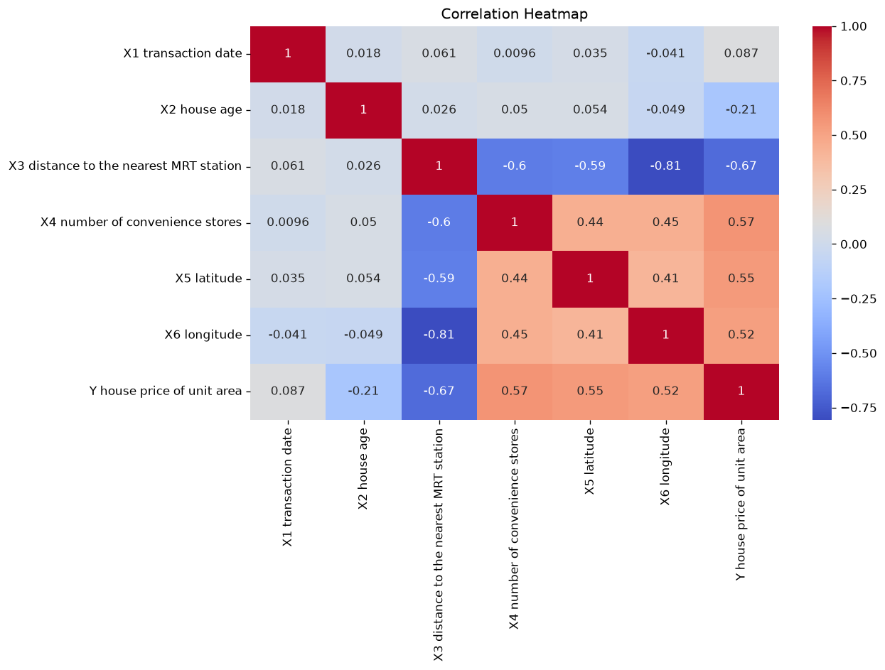
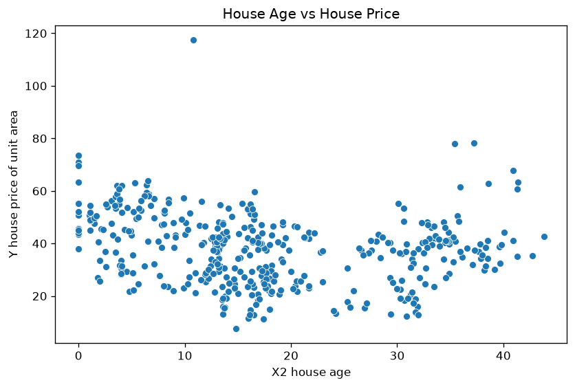
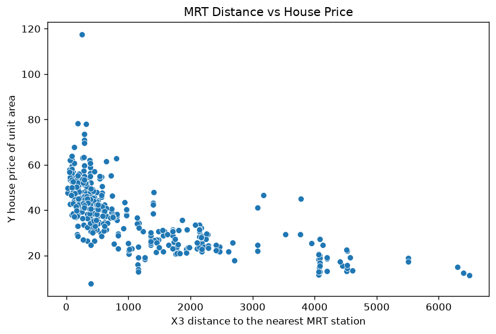
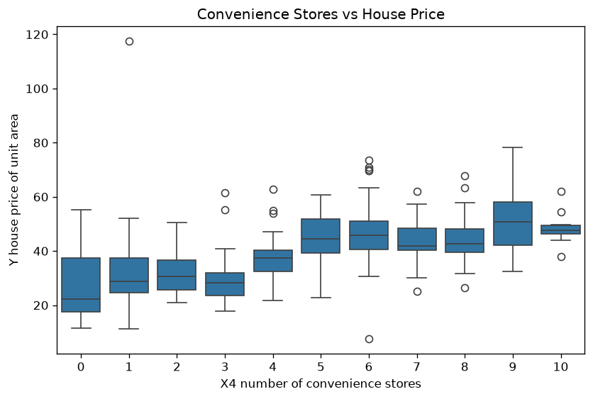
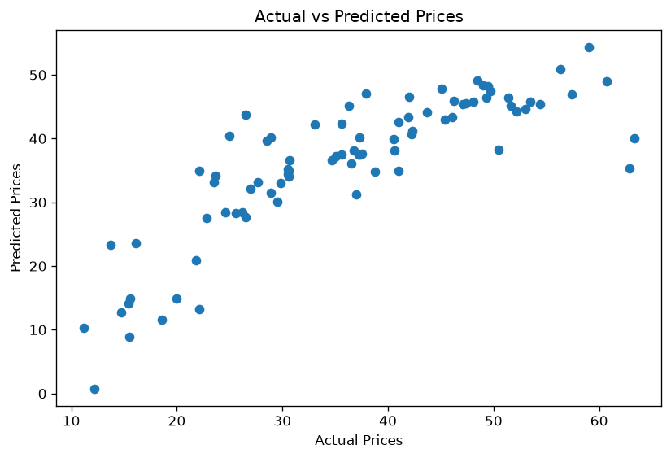
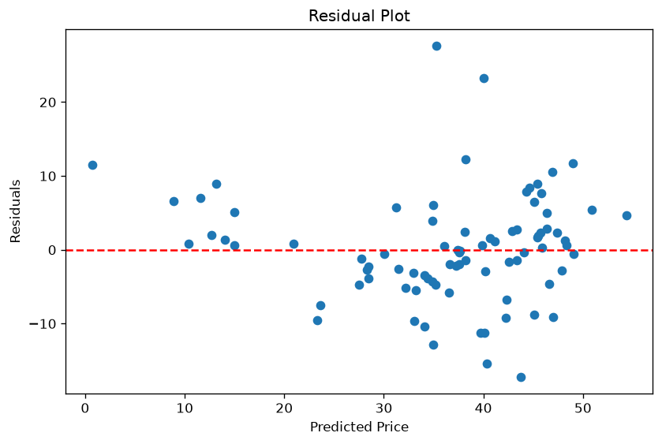
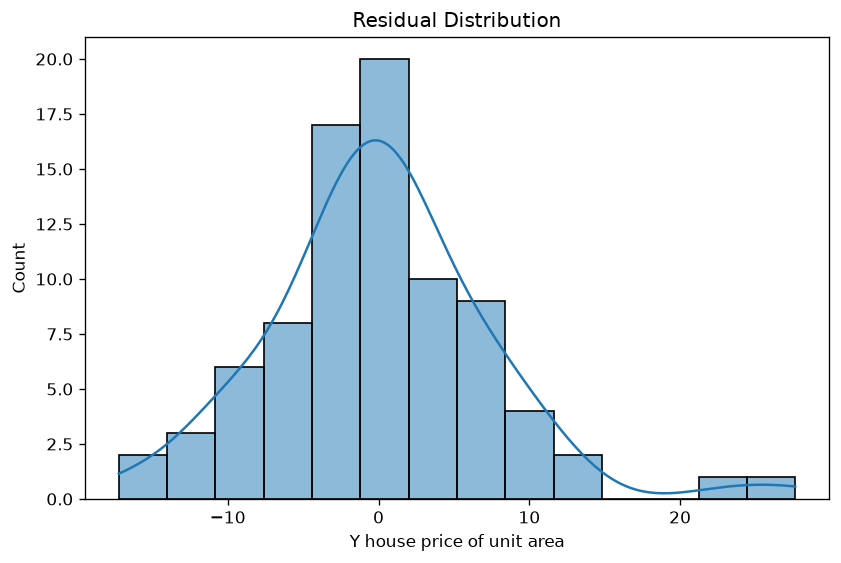
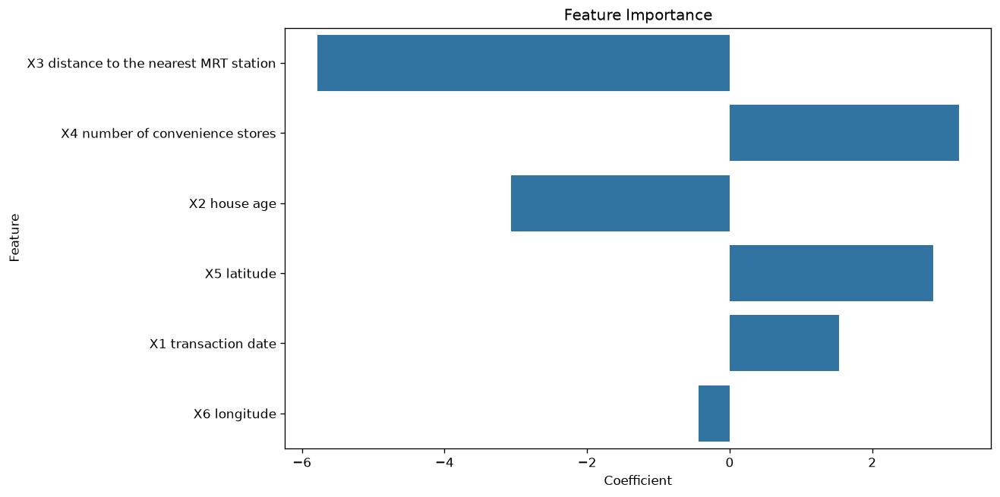

# Linear Regression Project — Code Explained

A walkthrough of `LinearRegression.py`, section by section, with the actual output graphs.

## 1. Import Libraries

- `pandas`, `numpy` → handling data (tables, math)
- `matplotlib`, `seaborn` → plotting graphs
- `sklearn` → the actual machine learning tools:
  - `train_test_split`, `cross_val_score` → splitting/testing data
  - `StandardScaler` → scaling features
  - `LinearRegression` → the model itself
  - `mean_absolute_error`, `mean_squared_error`, `r2_score` → scoring the model

## 2. Load Data

```python
df = pd.read_csv(...)
```

Reads the Real Estate CSV into a table (DataFrame) called `df`. `df.head()` shows the first 5 rows so you can eyeball the data.

## 3. Quick EDA (Exploratory Data Analysis)

Before touching the model, you check:

- `df.shape` → how many rows/columns (414 rows, 8 columns)
- `df.info()` → data types, are there nulls
- `df.describe()` → mean, min, max, std for every column
- `df.isnull().sum()` → count of missing values (0 here, good)
- `df.duplicated().sum()` → count of duplicate rows (0 here, good)

**Why:** linear regression breaks or gives bad results if your data is dirty (missing values, duplicates skewing the average).

## 4. Data Cleaning

```python
df.drop("No", axis=1, inplace=True)
```
Removes the `No` column — it's just a row ID/index, it has no real relationship with price, so it would only confuse the model.

```python
df.drop_duplicates(inplace=True)
```
Removes repeated rows so they don't get double-counted.

## 5. Detailed EDA (visual checks)

**Correlation heatmap** — shows which features move together with price.



**House Age vs Price** — checks the relationship shape visually.



**MRT Distance vs Price** — is it a straight line, a curve, or no pattern at all?



**Convenience Stores vs Price** — shows price spread for each store count.



**Why:** linear regression assumes a roughly straight-line relationship. These plots let you sanity-check that assumption before trusting the model.

## 6. Feature Engineering

```python
X = df.drop('Y house price of unit area', axis=1)   # all the INPUT columns
y = df['Y house price of unit area']                  # the OUTPUT (target) column
```

`X` is what the model uses to predict. `y` is the actual price it's trying to learn to predict.

## 7. Train Test Split

```python
X_train, X_test, y_train, y_test = train_test_split(X, y, test_size=0.2, random_state=42)
```

Splits the data: 80% to **train** the model, 20% held back to **test** it. The model never sees the test data during training — this is the only honest way to check if it actually learned something useful, rather than just memorizing the training rows.

`random_state=42` just makes the split reproducible (same split every run).

## 8. Feature Scaling

```python
scaler = StandardScaler()
X_train = scaler.fit_transform(X_train)
X_test = scaler.transform(X_test)
```

Rescales every column to have mean 0 and standard deviation 1.

**Why this matters:** your raw features are on very different scales (latitude ~25, MRT distance ~hundreds/thousands). Without scaling, you can't fairly compare which feature matters more just by looking at the size of its coefficient later. Scaling puts everything on equal footing.

Note: `fit_transform` is used on train (learns the scale from training data), but only `transform` is used on test (applies the same scale, doesn't "peek" at test data — this avoids data leakage).

## 9. Linear Regression Model

```python
model = LinearRegression()
model.fit(X_train, y_train)
```

This is where the actual learning happens. The model finds the best weights (one per feature) that draw the line/plane closest to the real prices in the training data, by minimizing squared error.

## 10. Predictions

```python
y_pred = model.predict(X_test)
```

Uses the learned weights to predict prices for the test data (data the model has never seen).

## 11. Evaluation Metrics

```python
mae  = mean_absolute_error(y_test, y_pred)   # average size of mistake
mse  = mean_squared_error(y_test, y_pred)    # average squared mistake
rmse = np.sqrt(mse)                          # same units as price, easy to read
r2   = r2_score(y_test, y_pred)              # % of price variation explained
```

Results from our run:

| Metric | Value | Meaning |
|---|---|---|
| MAE  | 5.31 | on average, predictions are off by about 5.31 price units |
| RMSE | 7.31 | bigger than MAE, meaning a few predictions missed badly |
| R²   | 0.68 | model explains 68% of the variation in price |

## 12. Overfitting Check

```python
train_r2 = model.score(X_train, y_train)
test_r2  = model.score(X_test, y_test)
```

Compares how well the model does on data it trained on vs. data it's never seen.

- If train R² >> test R² → **overfitting** (memorized training data)
- If both are low and similar → **underfitting** (model too simple)

Our result: train R² = 0.56, test R² = 0.68. Test score being higher than train is unusual — it suggests the test split happened to be "easier," and/or the model is underfitting (it may need non-linear features, since e.g. MRT distance doesn't fall off in a straight line with price).

## 13. Cross Validation

```python
cv_scores = cross_val_score(LinearRegression(), scaler.fit_transform(X), y, cv=5, scoring='r2')
```

Instead of trusting one lucky/unlucky train-test split, this repeats the fit-and-score process 5 times on different slices of the data, then you average the scores. This gives a more honest estimate of real-world performance than a single R² value.

Our result: scores ranged 0.44 to 0.71, averaging **0.585** — lower than the single-split R² of 0.68, meaning that 0.68 was a bit of a lucky split.

## 14. Actual vs Predicted Plot

A scatterplot of real prices (x-axis) vs predicted prices (y-axis). If the model were perfect, every point would sit on a diagonal line. The amount of scatter around that line shows you how wrong the model is.



## 15. Residual Analysis

```python
residuals = y_test - y_pred   # actual minus predicted = the error
```

Residual plot: predicted price vs residual. For a good linear model, residuals should be randomly scattered around 0 with no visible pattern. A pattern (like a curve, or errors growing with price) is a red flag that a straight line isn't the right shape for this data.



## 16. Residual Distribution

A histogram of the residuals. Ideally this looks like a bell curve (normal distribution) centered at 0 — that's one of the assumptions linear regression relies on for its results to be trustworthy.



## 17. Feature Importance

`coefficients` = each feature's weight from the trained model, sorted by size (ignoring sign).

Because the features were scaled (step 8) to the same range, the size of each coefficient is directly comparable — bigger number = bigger effect on price per "typical" change in that feature.

Our result, biggest to smallest effect:

| Rank | Feature | Coefficient | Direction |
|---|---|---|---|
| 1 | Distance to MRT station | -5.79 | closer to MRT = higher price |
| 2 | Number of convenience stores | +3.22 | more stores = higher price |
| 3 | House age | -3.06 | older house = lower price |
| 4 | Latitude | +2.86 | |
| 5 | Transaction date | +1.53 | |
| 6 | Longitude | -0.44 | weakest effect |

## 18. Feature Importance Visualization

A bar chart version of the table above — just a visual way to see at a glance which features matter most.



## The Big Picture

Every step in this script exists to answer one of three questions:

1. **Is my data clean enough to model?** (steps 2-6)
2. **Does the model actually fit well?** (steps 7-11)
3. **Can I trust that fit, and why does it work the way it does?** (steps 12-18)

That's the complete, standard workflow for any linear regression project.
