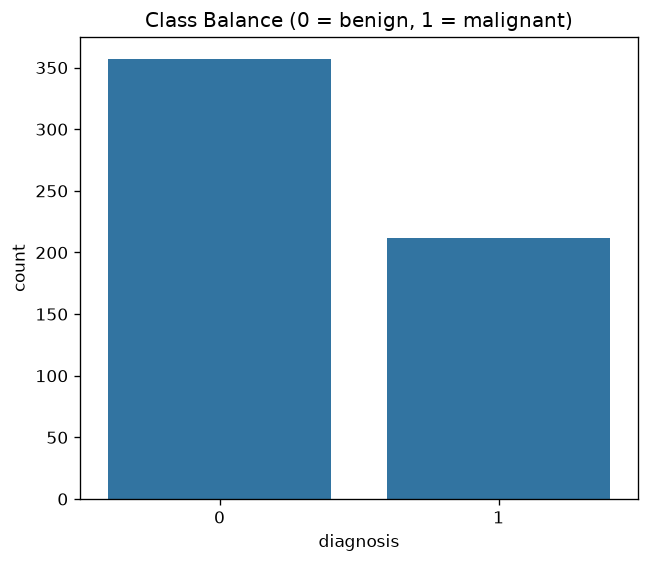
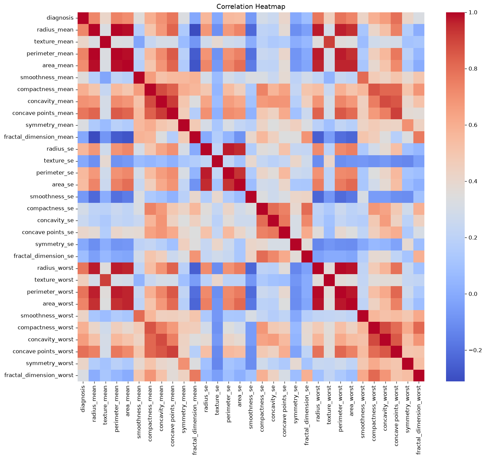
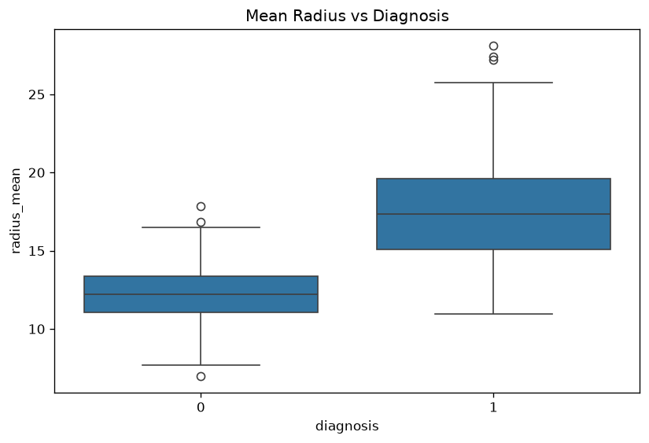
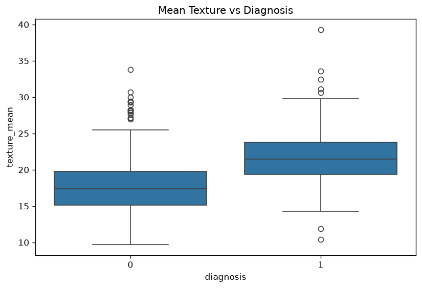
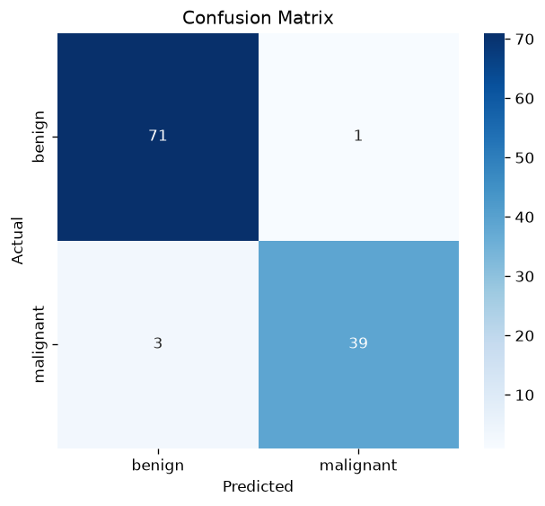
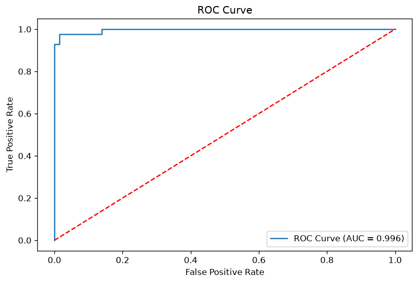
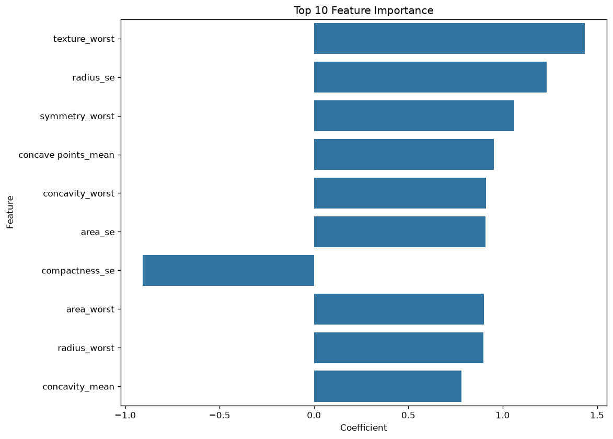

```
LOGISTIC REGRESSION PROJECT — CODE EXPLAINED
============================================
A walkthrough of LogisticRegression.py, section by section.


1. IMPORT LIBRARIES
--------------------
pandas, numpy        -> handling data (tables, math)
matplotlib, seaborn   -> plotting graphs
sklearn               -> the actual machine learning tools:
  - train_test_split, cross_val_score  -> splitting/testing data
  - StandardScaler, LabelEncoder       -> scaling features, encoding text labels
  - LogisticRegression                 -> the model itself
  - accuracy_score, precision_score, recall_score, f1_score,
    confusion_matrix, classification_report, roc_auc_score, roc_curve
                                        -> scoring the model

Note: unlike Linear Regression, the target here is a CATEGORY
(benign vs malignant), not a continuous number. So the model and all
the metrics below are built for CLASSIFICATION, not predicting a value.


2. LOAD DATA
------------
df = pd.read_csv("breast-cancer.csv")

Reads the Breast Cancer Wisconsin dataset into a table (DataFrame)
called df. print(df.head()) shows the first 5 rows so you can eyeball
the data.

The target column "diagnosis" comes in as text:
  M -> malignant (cancerous)
  B -> benign (non-cancerous)


3. QUICK EDA (Exploratory Data Analysis)
------------------------------------------
Before touching the model, you check:
  - df.shape       -> how many rows/columns (569 rows, 32 columns)
  - df.info()      -> data types, are there nulls
  - df.describe()  -> mean, min, max, std for every column
  - df.isnull().sum()    -> count of missing values (0 here, good)
  - df.duplicated().sum() -> count of duplicate rows (0 here, good)
  - df['diagnosis'].value_counts() -> class balance (357 benign, 212 malignant)

Why: classification models need clean data too, and you specifically
want to know if your classes are balanced or not — imbalanced classes
(e.g. 95% one class) can make accuracy misleading.


4. DATA CLEANING
-----------------
df.drop("id", axis=1, inplace=True)
  -> removes the "id" column. It's just a patient record ID, it has no
     real relationship with diagnosis, so it would only confuse the model.

df.drop_duplicates(inplace=True)
  -> removes repeated rows so they don't get double-counted.

le = LabelEncoder()
df['diagnosis'] = le.fit_transform(df['diagnosis'])
  -> converts the text labels into numbers the model can use:
     B -> 0, M -> 1


5. DETAILED EDA (visual checks)
---------------------------------
- Class balance countplot: how many benign vs malignant cases.
- Correlation heatmap: shows which features move together.
- Mean Radius vs Diagnosis boxplot: do malignant tumors have a bigger
  mean radius than benign ones?
- Mean Texture vs Diagnosis boxplot: same idea for texture.

Why: these checks tell you up front whether the features actually
separate the two classes before you trust the model's results.
```






```
6. FEATURE ENGINEERING
------------------------
X = df.drop('diagnosis', axis=1)   -> all the INPUT columns (30 measurements)
y = df['diagnosis']                 -> the OUTPUT (target) column

X is what the model uses to predict.
y is the actual class (benign=0/malignant=1) it's trying to learn to predict.


7. TRAIN TEST SPLIT
---------------------
X_train, X_test, y_train, y_test = train_test_split(
    X, y, test_size=0.2, random_state=42, stratify=y
)

Splits the data: 80% to TRAIN the model, 20% held back to TEST it.
The model never sees the test data during training — this is the only
honest way to check if it actually learned something useful.

stratify=y is new compared to Linear Regression: it makes sure both
the train and test sets keep the SAME proportion of benign/malignant
cases as the full dataset. Without it, a random split could accidentally
put too many of one class into the test set.

random_state=42 just makes the split reproducible (same split every run).


8. FEATURE SCALING
--------------------
scaler = StandardScaler()
X_train = scaler.fit_transform(X_train)
X_test  = scaler.transform(X_test)

Rescales every column to have mean 0 and standard deviation 1.

Why this matters: the 30 features here are on very different scales
(e.g. "area_mean" is in the hundreds/thousands, "smoothness_mean" is a
tiny decimal). Logistic Regression's optimizer converges faster and the
coefficients become comparable once everything is scaled the same way.


9. LOGISTIC REGRESSION MODEL
-----------------------------
model = LogisticRegression(max_iter=10000)
model.fit(X_train, y_train)

Unlike Linear Regression (which fits a straight line to predict a
number), Logistic Regression fits an S-shaped curve that squashes its
output between 0 and 1 — that output is interpreted as a PROBABILITY
of belonging to class 1 (malignant). max_iter is raised because the
optimizer needs more steps to converge with 30 features.


10. PREDICTIONS
-----------------
y_pred  = model.predict(X_test)              -> final class (0 or 1)
y_proba = model.predict_proba(X_test)[:, 1]  -> probability of being malignant

predict() applies a 0.5 cutoff to the probability to decide the class.
predict_proba() gives you the raw probability, which is needed for the
ROC curve later.


11. EVALUATION METRICS
-------------------------
accuracy  = accuracy_score(y_test, y_pred)    -> % of predictions correct overall
precision = precision_score(y_test, y_pred)   -> of predicted "malignant", % actually malignant
recall    = recall_score(y_test, y_pred)      -> of actual "malignant", % correctly caught
f1        = f1_score(y_test, y_pred)          -> balance of precision and recall
roc_auc   = roc_auc_score(y_test, y_proba)    -> how well probabilities rank the classes

Results from our run:
  Accuracy  = 0.965   -> 96.5% of test predictions were correct
  Precision = 0.975
  Recall    = 0.929
  F1 Score  = 0.951
  ROC AUC   = 0.996   -> near-perfect separation between the two classes

Note: these are different metrics from Linear Regression (MAE/RMSE/R²)
because we're now scoring CLASSES, not a continuous number.


12. OVERFITTING CHECK
------------------------
train_acc = model.score(X_train, y_train)
test_acc  = model.score(X_test, y_test)

Compares accuracy on data it trained on vs. data it's never seen.
  - If train acc >> test acc  -> OVERFITTING (memorized training data)
  - If both are low and similar -> UNDERFITTING (model too simple)

Our result: train accuracy = 0.987, test accuracy = 0.965.
These are close together — a good sign. The model is not overfitting,
and it's accurate on data it hasn't seen.


13. CROSS VALIDATION
-----------------------
cv_scores = cross_val_score(
    LogisticRegression(max_iter=10000), scaler.fit_transform(X), y, cv=5, scoring='accuracy'
)

Instead of trusting one lucky/unlucky train-test split, this repeats
the fit-and-score process 5 times on different slices of the data,
then averages the scores.

Our result: scores ranged 0.974 to 0.991, averaging 0.981 — actually a
bit HIGHER than the single-split test accuracy of 0.965, meaning the
test split we happened to get was slightly tougher than average, but
the model's real-world performance is consistently strong either way.


14. CONFUSION MATRIX
-----------------------
cm = confusion_matrix(y_test, y_pred)

A 2x2 table showing exactly where the model got it right and wrong:
  - top-left / bottom-right -> correct predictions
  - top-right / bottom-left -> mistakes (false positives / false negatives)

This matters more than plain accuracy in medical contexts: a false
negative (calling a malignant tumor "benign") is far more dangerous
than a false positive, so it's worth checking which kind of mistake
the model makes. Our recall of 0.929 means about 7% of actual
malignant cases were missed — worth knowing before trusting this in
any real diagnostic setting.
```



```
15. ROC CURVE
---------------
fpr, tpr, thresholds = roc_curve(y_test, y_proba)

Plots the True Positive Rate against the False Positive Rate as the
classification cutoff (normally 0.5) is slid from 0 to 1. The closer
the curve hugs the top-left corner, the better the model separates
the two classes. The diagonal red dashed line is what a random guess
would look like.

ROC AUC (Area Under the Curve) summarizes this in one number: 0.996
out of a possible 1.0 means the model almost perfectly ranks malignant
cases above benign ones, even though the 0.5 cutoff used for the
confusion matrix above missed a few.
```



```
16. FEATURE IMPORTANCE
-------------------------
coefficients = each feature's weight from the trained model, sorted by
size (ignoring sign).

Because the features were scaled (step 8) to the same range, the size
of each coefficient is directly comparable.
  - Positive coefficient -> pushes the prediction toward malignant (1)
  - Negative coefficient -> pushes the prediction toward benign (0)

Top features from our run:
  1. texture_worst        (+1.43) -> higher worst texture -> more malignant
  2. radius_se             (+1.23)
  3. symmetry_worst        (+1.06)
  4. concave points_mean   (+0.95)
  5. concavity_worst       (+0.91)

Most of the strongest features are positive, meaning larger/rougher
tumor measurements push the prediction toward malignant — which lines
up with medical intuition.


17. FEATURE IMPORTANCE VISUALIZATION
---------------------------------------
A bar chart of the top 10 features by coefficient size — a visual way
to see at a glance which measurements matter most for this diagnosis.
```



```
THE BIG PICTURE
==================
Logistic Regression follows the same workflow discipline as Linear
Regression, just adapted for predicting a CATEGORY instead of a NUMBER:
  1. Is my data clean enough to model, and are the classes balanced?
     (steps 2-5)
  2. Does the model separate the classes well?     (steps 6-11)
  3. Can I trust that result, and why does it work the way it does?
     (steps 12-17)

Key differences from Linear Regression to remember:
  - Model output is a PROBABILITY (squashed 0-1), not a raw number.
  - Metrics are accuracy/precision/recall/F1/ROC-AUC, not MAE/RMSE/R².
  - Confusion matrix and ROC curve replace residual plots.
  - stratify=y in the split matters because classes can be imbalanced.
  - Text labels (M/B) need encoding to numbers before fitting.
```
